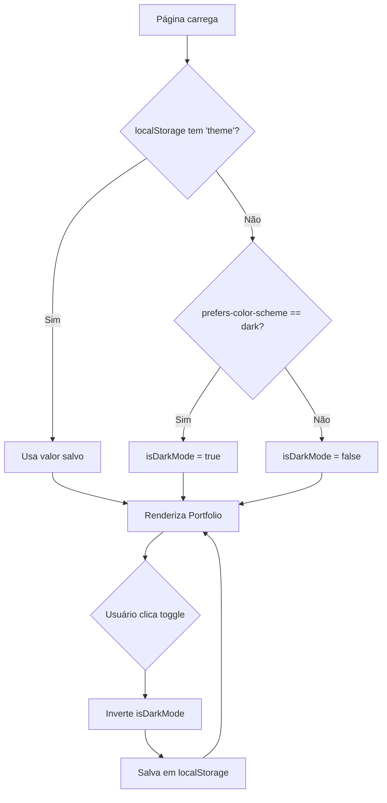

# Plano de Implementação - Personal Site Refatoração

**Data:** 2026-01-21  
**Projeto:** datadouglas.github.io  
**Objetivo:** Refatorar layout do site pessoal com separação de arquivos e toggle de tema

---

## Decisões de Arquitetura

| #   | Aspecto      | Decisão                                        |
| --- | ------------ | ---------------------------------------------- |
| 1   | JavaScript   | Babel inline (sem build step)                  |
| 2   | Roteamento   | Toggle `useState` (remove React Router)        |
| 3   | CSS          | Variables para tokens de cores                 |
| 4   | Imagem       | Referência relativa `./assets/img/perfil.jpeg` |
| 5   | Persistência | `prefers-color-scheme` + `localStorage`        |
| 6   | Arquivos JS  | `components.js` + `app.js`                     |
| 7   | Sidebar      | Scroll interno + Glassmorphism no header       |
| 8   | Título cargo | "Economista e Cientista de Dados"              |

---

## Estrutura de Arquivos

```
datadouglas.github.io/
├── index.html                  # Estrutura base + imports
├── assets/
│   ├── css/
│   │   └── main.css           # CSS variables + utilitários
│   ├── js/
│   │   ├── components.js      # Header, SidebarProfile, SidebarAnalytics, Portfolio
│   │   └── app.js             # App + lógica de tema + render
│   └── img/
│       └── perfil.jpeg        # Foto de perfil local
```

---

## Mudanças Propostas

### [NEW] assets/css/main.css

CSS Variables para suporte a temas:

```css
:root {
  /* Light Theme (default) */
  --primary: #10b981;
  --primary-hover: #059669;
  --bg: #f8f9fa;
  --surface: #ffffff;
  --border: #e2e8f0;
  --text-main: #1e293b;
  --text-secondary: #475569;
  --text-muted: #94a3b8;
  --code-bg: #1e293b;
}

:root.dark {
  --primary: #00ff80;
  --primary-hover: #00cc66;
  --bg: #121212;
  --surface: #1a1a1e;
  --border: #2e2e32;
  --text-main: #f1f5f9;
  --text-secondary: #9ca3af;
  --text-muted: #6b7280;
  --code-bg: #0d0d0d;
}
```

---

### [NEW] assets/js/components.js

Componentes React compartilhados:

- `Header` - com glassmorphism e toggle de tema
- `SidebarProfile` - card de perfil com imagem local
- `SidebarAnalytics` - gráficos Life Analytics
- `Portfolio` - feed de posts

---

### [NEW] assets/js/app.js

Lógica principal:

```javascript
// Detectar tema inicial
const getInitialTheme = () => {
  const stored = localStorage.getItem("theme");
  if (stored) return stored === "dark";
  return window.matchMedia("(prefers-color-scheme: dark)").matches;
};

// App com useState para tema
const App = () => {
  const [isDarkMode, setIsDarkMode] = useState(getInitialTheme);

  useEffect(() => {
    document.documentElement.classList.toggle("dark", isDarkMode);
    localStorage.setItem("theme", isDarkMode ? "dark" : "light");
  }, [isDarkMode]);

  return (
    <Portfolio
      isDarkMode={isDarkMode}
      onToggleTheme={() => setIsDarkMode(!isDarkMode)}
    />
  );
};
```

---

### [MODIFY] index.html

Estrutura limpa:

```html
<!DOCTYPE html>
<html lang="pt-BR">
  <head>
    <meta charset="UTF-8" />
    <meta name="viewport" content="width=device-width, initial-scale=1.0" />
    <title>Douglas Furbino - Economista e Cientista de Dados</title>
    <meta
      name="description"
      content="Portfolio de Douglas Furbino - Economista e Cientista de Dados"
    />

    <!-- Fonts -->
    <link
      href="https://fonts.googleapis.com/css2?family=Space+Grotesk:wght@300..700&family=Noto+Sans:wght@400;500;700&display=swap"
      rel="stylesheet"
    />
    <link
      href="https://fonts.googleapis.com/css2?family=Material+Symbols+Outlined"
      rel="stylesheet"
    />

    <!-- Tailwind CDN -->
    <script src="https://cdn.tailwindcss.com"></script>

    <!-- Custom CSS -->
    <link rel="stylesheet" href="./assets/css/main.css" />

    <!-- React -->
    <script src="https://unpkg.com/react@18/umd/react.development.js"></script>
    <script src="https://unpkg.com/react-dom@18/umd/react-dom.development.js"></script>
    <script src="https://unpkg.com/babel-standalone@6/babel.min.js"></script>
  </head>
  <body>
    <div id="root"></div>
    <script type="text/babel" src="./assets/js/components.js"></script>
    <script type="text/babel" src="./assets/js/app.js"></script>
  </body>
</html>
```

---

## Correções Incluídas

| Problema                | Correção                            |
| ----------------------- | ----------------------------------- |
| Typo "Dadosr"           | → "Economista e Cientista de Dados" |
| `<style>` duplicado     | Removido                            |
| Copyright 2024          | → 2026                              |
| `Math.random()` opacity | Valores pré-definidos estáveis      |
| Imagem externa          | `./assets/img/perfil.jpeg`          |
| React Router            | Removido (toggle useState)          |
| Meta tags SEO           | Adicionadas                         |

---

## Fluxo de Detecção de Tema



---

## Ordem de Implementação

1. ✅ Criar `assets/css/main.css`
2. ✅ Criar `assets/js/components.js`
3. ✅ Criar `assets/js/app.js`
4. ✅ Atualizar `index.html`
5. ✅ Testar localmente
6. ⏳ Commit e deploy

---

**Status:** Aprovado para implementação
