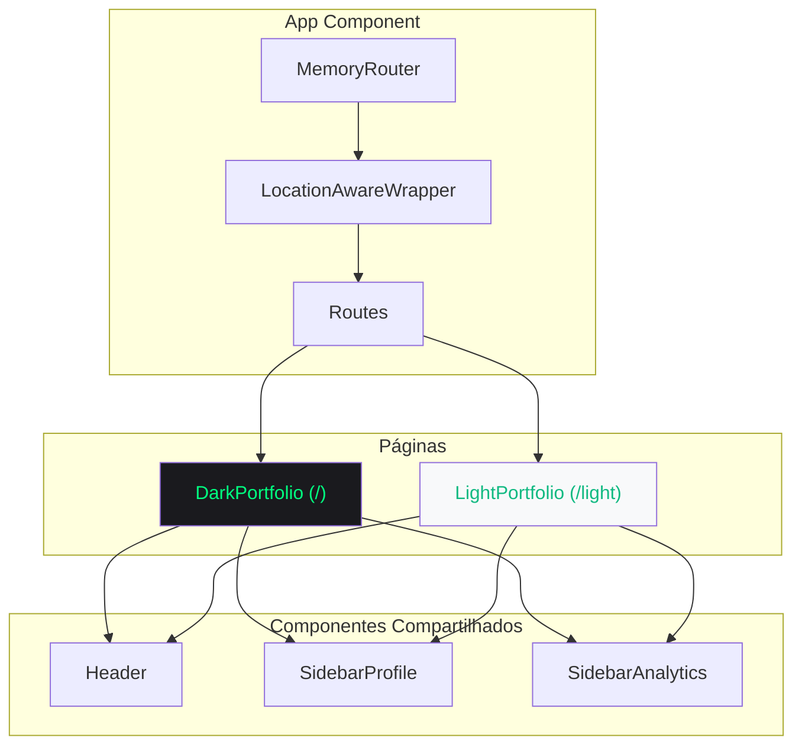

# 🔍 Relatório de Debug - index.html (Personal Site Layout)

**Data:** 2026-01-21  
**Arquivo:** `index.html`  
**Descrição:** Layout de site pessoal inspirado no LinkedIn e Supabase, com 3 colunas (Perfil, Posts, Analytics)

---

## 📊 Resumo da Análise

| Prioridade | Quantidade |
| ---------- | ---------- |
| 🔴 Crítico | 0          |
| 🟠 Alta    | 2          |
| 🟡 Média   | 5          |
| 🟢 Baixa   | 4          |

---

## 🔴 CRÍTICO

> Nenhum problema crítico encontrado.

---

## 🟠 ALTA PRIORIDADE

### 1. Typo no Texto do Perfil

- 📁 **Arquivo:** `index.html` | **Linha:** 126
- ❌ **Problema:** Texto com erro de digitação: `"Economista e Cientista de Dadosr"` (com "r" sobrando no final)
- ⚠️ **Impacto:** Apresentação profissional comprometida; o texto é visível na sidebar do perfil
- ✅ **Correção:** Alterar para `"Economista e Cientista de Dados"`

```jsx
// ❌ Atual
<p className={`text-[13px] ...`}>Economista e Cientista de Dadosr</p>

// ✅ Correto
<p className={`text-[13px] ...`}>Economista e Cientista de Dados</p>
```

---

### 2. Duplicação de Bloco `<style>` no `<head>`

- 📁 **Arquivo:** `index.html` | **Linhas:** 76-90 e 91-95
- ❌ **Problema:** O mesmo estilo `body { min-height: max(884px, 100dvh); }` está declarado duas vezes em blocos `<style>` separados
- ⚠️ **Impacto:** Código redundante; pode causar confusão em manutenção futura
- ✅ **Correção:** Remover o bloco duplicado (linhas 91-95)

```html
<!-- ❌ DUPLICADO (remover) -->
<style>
  body {
    min-height: max(884px, 100dvh);
  }
</style>
```

---

## 🟡 MÉDIA PRIORIDADE

### 3. Uso de `MemoryRouter` em vez de `BrowserRouter`

- 📁 **Arquivo:** `index.html` | **Linha:** 682
- ❌ **Problema:** `MemoryRouter` é usado para roteamento, o que não atualiza a URL do navegador
- ⚠️ **Impacto:**
  - Usuários não podem compartilhar links diretos para `/light`
  - O botão "voltar" do navegador não funciona como esperado
  - SEO não consegue indexar rotas diferentes
- ✅ **Correção:** Considerar usar `BrowserRouter` ou `HashRouter` para que as URLs sejam refletidas na barra de endereços

```jsx
// Alternativa com HashRouter (funciona em GitHub Pages)
const { HashRouter, Routes, Route, Link } = ReactRouterDOM;
// ...
return (
  <HashRouter>
    <LocationAwareWrapper />
  </HashRouter>
);
```

> [!NOTE]
> Para GitHub Pages, `HashRouter` é recomendado pois não requer configuração de servidor.

---

### 4. Ano do Copyright Desatualizado

- 📁 **Arquivo:** `index.html` | **Linha:** 186
- ❌ **Problema:** Copyright mostra `© 2024` mas estamos em 2026
- ⚠️ **Impacto:** Impressão de site desatualizado
- ✅ **Correção:** Atualizar para `© 2026` ou usar JavaScript para ano dinâmico

---

### 5. Opacity Aleatória no Site Activity Grid

- 📁 **Arquivo:** `index.html` | **Linhas:** 170-172
- ❌ **Problema:** `Math.random()` é usado para gerar opacidade dos dots, resultando em valores diferentes a cada re-render
- ⚠️ **Impacto:** Flicker visual quando o componente re-renderiza; inconsistência visual
- ✅ **Correção:** Usar seed ou valores pré-definidos para opacidade

```jsx
// ❌ Atual (valores mudam a cada render)
style={{ opacity: Math.random() * 0.9 + 0.1 }}

// ✅ Sugestão (valores estáveis baseados no índice)
style={{ opacity: ((i * 17) % 10) / 10 * 0.8 + 0.2 }}
```

---

### 6. Links de Navegação Vazios (href="#")

- 📁 **Arquivo:** `index.html` | **Linhas:** 308-309, 462, 467, 628, 633
- ❌ **Problema:** Múltiplos links usam `href="#"` como placeholder
- ⚠️ **Impacto:** Comportamento inesperado ao clicar; scroll para topo da página
- ✅ **Correção:** Substituir por rotas válidas, `javascript:void(0)`, ou usar `<button>` se não for navegação real

---

### 7. Botões Sem Funcionalidade

- 📁 **Arquivo:** `index.html` | **Múltiplas linhas** (ex: 118, 150-157, 198, 351, etc.)
- ❌ **Problema:** Vários botões (Edit Profile, GitHub, LinkedIn, Share, etc.) não têm `onClick` handlers
- ⚠️ **Impacto:** Elementos interativos sem ação confundem usuários
- ✅ **Correção:** Implementar handlers ou adicionar `disabled` state visual até implementação

---

## 🟢 BAIXA PRIORIDADE

### 8. Meta Tags SEO Incompletas

- 📁 **Arquivo:** `index.html` | **Linhas:** 3-6
- ❌ **Problema:** Faltam meta tags importantes: `description`, `og:title`, `og:image`, `twitter:card`
- ⚠️ **Impacto:** Compartilhamento em redes sociais sem preview rico
- ✅ **Correção sugerida:**

```html
<meta
  name="description"
  content="Douglas Furbino - Economista e Cientista de Dados. Portfolio de projetos em Machine Learning, AI e Data Science."
/>
<meta property="og:title" content="Douglas Furbino - DS" />
<meta
  property="og:description"
  content="Portfolio de projetos em ML e Data Science"
/>
<meta property="og:image" content="URL_DA_IMAGEM_DE_PREVIEW" />
<meta name="twitter:card" content="summary_large_image" />
```

---

### 9. Dependências CDN em Modo Development

- 📁 **Arquivo:** `index.html` | **Linhas:** 69-74
- ❌ **Problema:** React e React Router estão usando versões `.development.js`
- ⚠️ **Impacto:** Bundle maior, warnings no console, performance reduzida em produção
- ✅ **Correção:** Usar versões `.production.min.js` para deploy

```html
<!-- Produção -->
<script src="https://unpkg.com/react@18/umd/react.production.min.js"></script>
<script src="https://unpkg.com/react-dom@18/umd/react-dom.production.min.js"></script>
```

---

### 10. Babel Standalone para Transpilação

- 📁 **Arquivo:** `index.html` | **Linha:** 74
- ❌ **Problema:** `babel-standalone` transpila JSX no navegador (client-side)
- ⚠️ **Impacto:** Performance de carregamento inicial mais lenta
- ✅ **Correção:** Para produção, considerar pre-compilar com Vite ou outro bundler

---

### 11. Imagem de Perfil de URL Externa

- 📁 **Arquivo:** `index.html` | **Linhas:** 116, 339, 506
- ❌ **Problema:** Imagem de perfil usa URL do Google AIDA que pode expirar ou mudar
- ⚠️ **Impacto:** Imagem pode quebrar no futuro
- ✅ **Correção:** Hospedar imagem localmente no repositório

---

## 🧩 Diagrama de Arquitetura do Layout



---

## 📋 Checklist de Correções

- [ ] Corrigir typo "Dadosr" → "Dados"
- [ ] Remover bloco `<style>` duplicado
- [ ] Avaliar migração para `HashRouter`
- [ ] Atualizar ano do copyright
- [ ] Estabilizar opacidade do activity grid
- [ ] Substituir `href="#"` por ações válidas
- [ ] Adicionar meta tags SEO
- [ ] Migrar para versões production do React
- [ ] Hospedar imagem de perfil localmente

---

## 📌 Contexto do Life-Analytics

O projeto **Life-Analytics** foi exportado com sucesso. Os gráficos da sidebar direita (`SidebarAnalytics`) estão preparados para receber dados reais de:

- YouTube Activity (Normal, Shorts, Music)
- Screen Time Intensity
- Experience vs Salary

> [!TIP]
> Os dados processados do Life-Analytics podem ser integrados via fetch API ou importação direta de JSON.

---

**Relatório gerado automaticamente pelo workflow de debug.**
