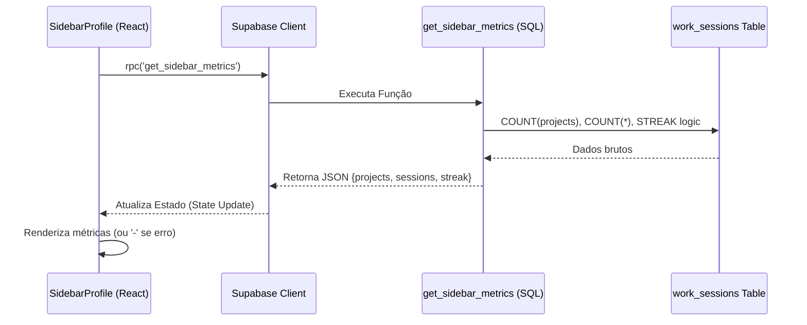

# Plano de Implementação: Métricas do Dashboard via Supabase

Substituir os dados estáticos da [SidebarProfile.jsx](file:///c:/Users/dougf/OneDrive/Documentos/GitHub/datadouglas.github.io/src/components/SidebarProfile.jsx) por métricas reais extraídas da tabela `work_sessions` do repositório `context-keeper`.

## Proposta de Mudanças

### Backend (Supabase)

Criar uma função SQL (RPC) no banco de dados para evitar múltiplas chamadas do frontend e centralizar a lógica de agregação.

```sql
CREATE OR REPLACE FUNCTION get_sidebar_metrics()
RETURNS JSON AS $$
DECLARE
    result JSON;
BEGIN
    WITH daily_sessions AS (
        SELECT DISTINCT DATE_TRUNC('day', created_at) as work_day
        FROM work_sessions
        ORDER BY work_day DESC
    ),
    streak_calc AS (
        SELECT
            work_day,
            work_day + (ROW_NUMBER() OVER (ORDER BY work_day DESC) * INTERVAL '1 day') as grp
        FROM daily_sessions
    ),
    current_streak AS (
        SELECT
            CASE
                WHEN MAX(work_day) >= CURRENT_DATE - INTERVAL '1 day' THEN COUNT(*)::INT
                ELSE 0
            END as streak
        FROM streak_calc
        WHERE grp = (SELECT grp FROM streak_calc LIMIT 1)
    )
    SELECT json_build_object(
        'projects', (SELECT COUNT(DISTINCT project_name) FROM work_sessions),
        'sessions', (SELECT COUNT(*) FROM work_sessions),
        'streak', (SELECT COALESCE(streak, 0) FROM current_streak)
    ) INTO result;

    RETURN result;
END;
$$ LANGUAGE plpgsql;
```

### Frontend (React)

#### [MODIFY] [package.json](file:///c:/Users/dougf/OneDrive/Documentos/GitHub/datadouglas.github.io/package.json)

- Adicionar `@supabase/supabase-js` às dependências.

#### [NEW] [supabaseClient.js](file:///c:/Users/dougf/OneDrive/Documentos/GitHub/datadouglas.github.io/src/lib/supabaseClient.js)

- Inicializar o cliente Supabase usando as variáveis de ambiente do `.env`.

#### [MODIFY] [SidebarProfile.jsx](file:///c:/Users/dougf/OneDrive/Documentos/GitHub/datadouglas.github.io/src/components/SidebarProfile.jsx)

- Importar o cliente Supabase.
- Implementar `useState` e `useEffect` para buscar as métricas via `supabase.rpc('get_sidebar_metrics')`.
- Atualizar o mapeamento de `Stats` para usar os valores dinâmicos.

## Fluxo de Dados



## Plano de Verificação

### Testes Manuais

1. **Verificação de Conexão:** Abrir o console do navegador e garantir que não há erros de CORS ou 401/403 ao chamar o Supabase.
2. **Comparação de Dados:** Verificar se o número de projetos no site bate com o número de projetos distintos na tabela `work_sessions` (via `SELECT COUNT(DISTINCT project_name) FROM work_sessions`).
3. **Simulação de Erro:** Renomear temporariamente a variável de ambiente da Key do Supabase e verificar se a sidebar exibe `-` graciosamente.
